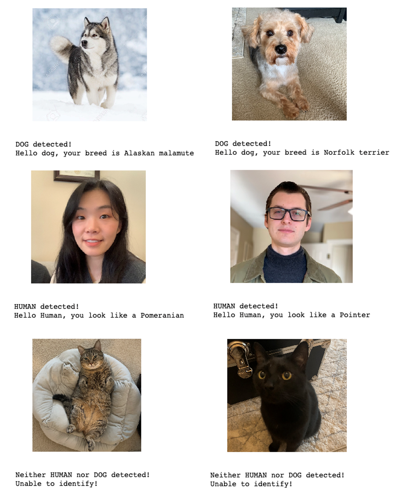

# Dog Breed Classifier

## Table of Contents

1. [Project Overview](#project_overview)
2. [Installation](#installation)
3. [File Descriptions](#files)
4. [Results](#results)
5. [Licensing, Authors, and Acknowledgements](#licensing)

## Project Overview 

In this project, a dog breed classifier is built using transfer learning on VGG16 model, which can be used within a web or mobile app to process real-world, user-supplied images.  Given an image of a dog, the classifier will identify an estimate of the canine’s breed.  If supplied an image of a human, the code will identify the resembling dog breed.  

## Installation 

1. Python versions 3.6
2. Library and packages: pytorch, cv2, tqdm, PIL, os, glob, numpy, pandas, matplotlib, pickle

## File Descriptions 

### Folders: 
**dhaarcascades:** contains the face detector files

**images:** contains the images used in the notebooks or test sample images

### Files:
**dog_app.ipynb:** the main notebook contains all the codes

**report.html:** html format of dog_app.ipynb

**workspace_utils.py:** functions used in the notebooks

## Results

The dog classifier built on top og VGG16 results in 87% accuracy score on the test data. Some sample results are given below.

## Licensing, Authors, and Acknowledgements

Acknowledge to [Udacity](https://www.udacity.com/) for providing the starter codes.  

